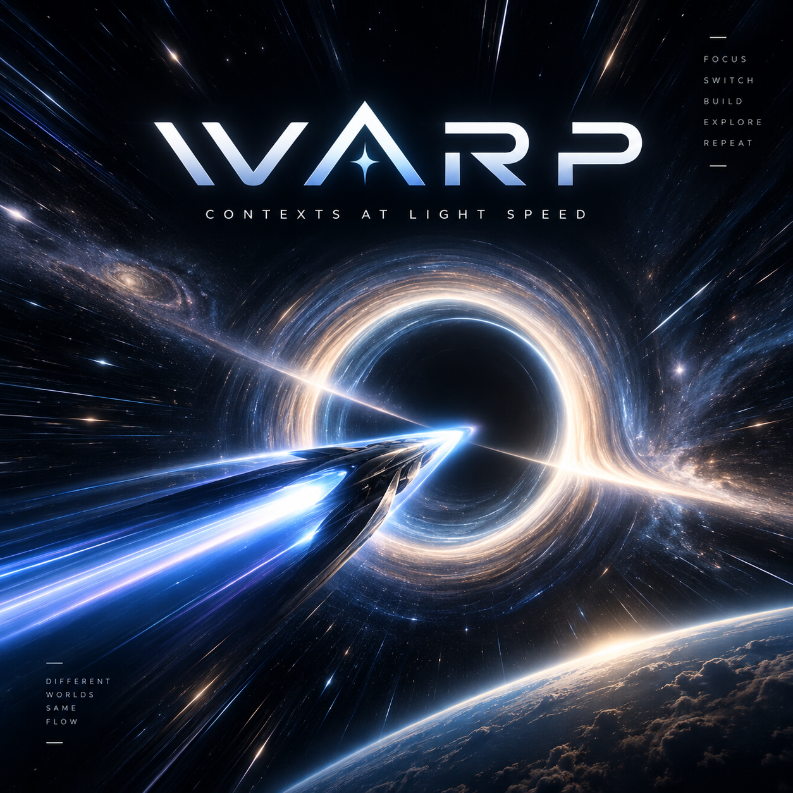

<p align="center">
  
</p>

# WARP

**Your work context, one chord away.**

WARP is a lightweight macOS workflow manager built with Hammerspoon and Lua. WARP performs **workflow resource/context restoration** for a fixed set of apps: VS Code, Safari, Finder, Terminal, Figma, and Docker Desktop UI. Each adapter has its own resource identity and presentation rules; resources may be shared across workflows. Switching aims for roughly **1–5 seconds**, with **5–10 seconds** as the acceptable upper bound; live timings depend on macOS, permissions, and the configured adapters.

Safari's AX switching has passed the user's live testing. The new GENERAL, Finder, and resource-preserving lifecycle integration still needs live acceptance. See the [implementation report](docs/implementation-report.md).

## Use it

Hold **Control + Option + Command** to reveal the radial wheel, then press a configured number. Release a modifier or press Escape to cancel. Existing letter shortcuts pass through and dismiss the overlay. **Control + Option + Right/Left** navigates the active workflow's registered Spaces.

On load/reload, runtime Code resource state resets and **GENERAL becomes ACTIVE in curation mode**. Existing normal Code windows are exposed; fullscreen windows remain fullscreen. Safari selects Local through the existing AX adapter, and Finder refreshes its home/configured directory. Reload now deliberately performs these actions; the earlier desktop-neutral rule is obsolete. Other adapters follow their explicit configuration.

On first use, Code curation exposes candidates without marking the workflow configured. Arrange, minimize, close, or open resources yourself; departure captures the resulting resource set and presentation. An explicit configured flag distinguishes never-curated from captured-with-zero-resources. GENERAL follows the same resource rules as named workflows.

## Installation

Requires macOS, Hammerspoon, Accessibility permission, and Apple command-line tools for the fallback test runner. Enable **Displays have separate Spaces** for multi-monitor navigation. Allow Finder Automation when macOS prompts (and Terminal if explicitly configured).

```sh
bash install.sh                   # show the loader; change nothing
bash install.sh --install-loader  # back up init.lua and append the loader
```

If you already have a working WARP `dofile(...)` loader, keep it. The installer preserves existing configuration and refuses to modify a symlinked init file. Edit `config/workflows.lua`, then run `WARP.reload()` in the Hammerspoon console.

## Convention-first workflows

```lua
return {
  general = {label = 'GENERAL', key = '0'}, -- Finder defaults to your home directory
  soft2412 = {
    label = 'SOFT2412', key = '2',
    finder = '/Users/rajdipshah/UNI/Y3S1 - 2026 sem 2/SOFT2412',
  },
  warp = {
    label = 'WARP', key = '3',
    finder = '/absolute/path/to/WARP',
  },
}
```

For named workflows, Safari defaults to `label`, Code resource handling defaults enabled, and `primary` defaults to `'none'`. Create the corresponding native Safari Tab Group yourself. Explicit `safari = {tabGroup = 'Another group'}`, `vscode = true`, and configured primary overrides remain supported. Use `safari = false` or `vscode = false` to opt out of that named workflow's adapter policy.

The reserved workflow ID `general` is added with key `0` if omitted; its key can be changed explicitly if needed. It always uses Safari Local and participates in Code curation/resource restoration. Its Finder default is the user's home directory. The repository includes GENERAL, ELEC3609, and SOFT2412. **ELEC3609 has a Finder-path TODO** because no actual path was supplied; Finder is skipped for that workflow until configured. Historical example paths are not assumed to be real project locations.

Optional existing Terminal/tmux and Figma settings remain supported; no new tmux switching is implemented. Use `apps = {{id = 'docker'}, {id = 'figma'}}` to declare those UI contexts relevant; omission leaves them irrelevant. Docker's backend is not managed. Old Finder ownership tables, Finder primary/Space ordering, and obsolete Code root/CLI settings are ignored with warnings. Finder is configured with a single absolute (or `~/`) directory string.

`config/settings.lua` controls the state directory, navigation shortcuts, and notifications. Configuration is data-only Lua. Duplicate numeric selectors and unknown fields are rejected.

## Finder location context

On every explicit switch, including reselection, Finder validates the configured directory, calls `hs.osascript.applescript` to `close every Finder window`, waits **300 ms**, then invokes `/usr/bin/open` with the directory as an argument-array entry through `hs.task`. Finder is not quit, snapshotted, or treated as an owned window. Browsing windows/tabs are discarded as requested.

Missing paths, close failures, and nonzero open exits are isolated from Code and Safari. The close script has a three-second AppleScript timeout; the open helper has a three-second process timeout. A zero open exit confirms the command completed, not a separate AX verification of Finder's displayed directory. Cancellation prevents a pending open, but cannot recall an already-delivered native action.

## App-specific resource identity

| Adapter | Identity and behavior |
|---|---|
| Safari | Existing native Tab Group; working AX route is unchanged. GENERAL selects Local. |
| Finder | Configured directory; close browsing windows, wait 300 ms, argument-array `open`. |
| Terminal | Existing tmux/session configuration; no new window snapshot model or session commands. |
| VS Code | Verified local folder or `.code-workspace` descriptor, plus independent presentation per workflow. |
| Figma | Unambiguous live window titles under declared Figma contexts. Exact missing-document reopening is unsupported. |
| Docker | Declared Desktop UI context; restore/minimize windows or launch the UI when required. Backend/containers stay untouched. |

## VS Code resources

Each workflow retains a resource map with independent `visibility` (visible/minimized) and `restorePresentation` (normal/fullscreen), a normal pixel frame, and screen UUID. Minimizing a fullscreen resource retains fullscreen restore intent even though macOS must first exit fullscreen. A visible normal window captured on departure records normal intent. In-progress or cancelled WARP restores retain their target metadata during capture, including same-workflow reselection. Previously unobserved minimized windows default to normal; WARP cannot infer fullscreen history from a minimized native window alone. Stable keys are `folder:<path>` or `workspace:<path>` obtained from the existing companion. The same resource can have different state in several workflows. Closing it while curating B does not erase A's saved resource. Configured captures merge live updates into the outgoing workflow's map, retaining closed resources and their last presentation. First-time curation includes only resources live at its first capture.

- Relevant live normal resources restore their saved frames and visibility. Minimized entries use **unminimize → setFrame → minimize**.
- Relevant missing resources reopen through Code's argument-array CLI **only when saved visible/fullscreen**. A new native window must be verified against the exact descriptor before its state is applied. Post-launch inventory checks retry at most three times for companion startup; unresolved identity never triggers a second speculative launch. Known live bindings exclude stale closed companion sessions from duplicate checks; unmapped live windows still require complete inventory.
- Missing minimized resources remain remembered but do not reopen.
- Irrelevant live normal resources minimize, never close. For relevant live resources, target presentation wins: exit fullscreen before restoring a normal/minimized frame, or unminimize and enter fullscreen when saved fullscreen. Unminimization is verified before fullscreen entry. Code resources restore serially: one resource completes verification before the next starts, and cancellation drops the remaining queue. Each native transition phase is polled every 50 ms for up to two seconds; frame/minimized state is then verified for up to 750 ms. Already-fullscreen targets and irrelevant fullscreen windows are preserved. No Mission Control ordering is restored.
- Normal changes are verified every 50 ms for up to 750 ms with two-pixel frame tolerance. No `moveWindowToSpace` or app-wide hide/show is used.

There are no owner sets, adoption counters, or ten-second qualification loops. A small focus watcher obtains descriptors through fresh companion probes; it does not assign workflow membership. Each switch refreshes the companion inventory before outgoing capture. Runtime maps, bindings, and configured flags reset on reload.

### Companion and safe fallback

For reliable folder/workspace reopening, install the bundled companion once:

```sh
python3 extras/vscode-companion/package.py
"/Applications/Visual Studio Code.app/Contents/Resources/app/bin/code" --install-extension /tmp/warp-companion-0.1.0.vsix
```

Reload Code windows after installation. Focus windows during curation so their native runtime handles can be paired with fresh companion responses. Untrusted/remote/untitled workspaces and windows without a verified descriptor retain only runtime presentation; WARP cannot safely reopen them. It never guesses identity from Code titles.

A missing/incomplete inventory or an unmapped matching live resource defers reopening to avoid duplicates. Failed or cancelled launches remain marked uncertain for the runtime session; WARP does not repeatedly launch them. Descriptor inventory/probes are bounded, request-driven operations, not an idle polling service. Many missing resources can take longer than the usual 1–5 second switch target.

Figma supports declared, potentially shared UI contexts, preserves ambiguous windows, and reports missing documents rather than guessing a URL or applying a missing document's layout to a different title. It may launch Figma and rely on native app restoration; it cannot guarantee a particular document reopened. Docker launches only Desktop UI when declared relevant and missing. Neither adapter closes irrelevant windows. Code curation is dynamic; Figma/Docker relevance currently comes from explicit `apps` configuration.

## WARM and COLD preserve resources

Switching away marks the outgoing workflow WARM. After 30 minutes by default, the existing lifecycle timer can mark an unpinned WARM workflow COLD. **COLD closes nothing.** It is a metadata transition: no Code window closes/reopens, no app quits, no tmux session dies, and no Docker service stops. Normal windows keep their current minimized state; native fullscreen windows stay fullscreen. Entering GENERAL restores its resources after it has been curated.

`vscode_cold.lua` remains a historical experiment, not a production instance. Old `vscodeCold` intents are discarded. The bridge/companion are reused only for descriptor inventory and probes; production never sends their experimental close command. COLD makes no RAM-reclamation promise.

Docker's engine, containers, images, volumes, and Compose workloads are not controlled. ChatGPT, Spotify, and other apps outside the fixed managed set remain global and untouched.

## Safari

Safari must already be running with the native groups configured. Its working AX implementation is preserved: background Safari receives `hs.application.launchOrFocus("Safari")`; already-frontmost Safari retains a 200 ms initial delay. Fresh AX roots are polled every 50 ms for at most two seconds until Safari is frontmost and the toolbar picker exists. No explicit Space switching is added.

The picker identifier supplies current state (empty means Local). If already at the target, no navigation is sent. WARP presses the picker, reads the displayed order after 120 ms, deduplicates from `<N> Tabs` to the creation commands, and closes with Escape. After 80 ms it sends the shortest Cmd+Shift+Down/Up route, 60 ms apart; ties go forward. Final AX verification starts 200 ms after the last hop, polling every 50 ms for up to 750 ms. A missing target fails Safari only; no tabs or groups are recreated.

Normal switching needs no Safari database access or visible sidebar. `WARP.debugSafariSwitch()` is a separate legacy DB/keyboard diagnostic and requires readable SafariTabs.db; it is not the production route. Make the intended Safari window frontmost within Safari when multiple windows expose eligible pickers.

## Diagnostics and tests

```lua
WARP.status()
WARP.debugVSCodeResources() -- workflow resource maps and configured flags
WARP.switchTo('soft2412')
WARP.switchTo('general')
WARP.checkpoint()
WARP.makeCold('soft2412')   -- only unpinned WARM; metadata only
WARP.pin('soft2412')
WARP.unpin('soft2412')
WARP.previewWheel(true)    -- selection logs only
WARP.previewWheel(false)
WARP.reload()
WARP.stop()
```

```sh
bash tests/run.sh
```

Tests cover configuration, lifecycle, snapshots, persistence, mocked GUI orchestration, shell/JavaScript syntax, and installer preservation. The retained companion experiment has a mocked VS Code test requiring a native temporary filesystem watcher. Passing tests do not establish live GUI compatibility.

State at `~/.workflow-manager/state.json` is written atomically. Corrupt state is preserved with persistence disabled. Code resource maps/bindings, Code/Finder runtime identities and layouts, old COLD intents, and runtime Space IDs are not persisted. A newer request cancels stale timers/helpers; already-delivered OS commands cannot be recalled. See the [current contract and historical design notes](docs/workflow-manager.md) for scope and limitations.
