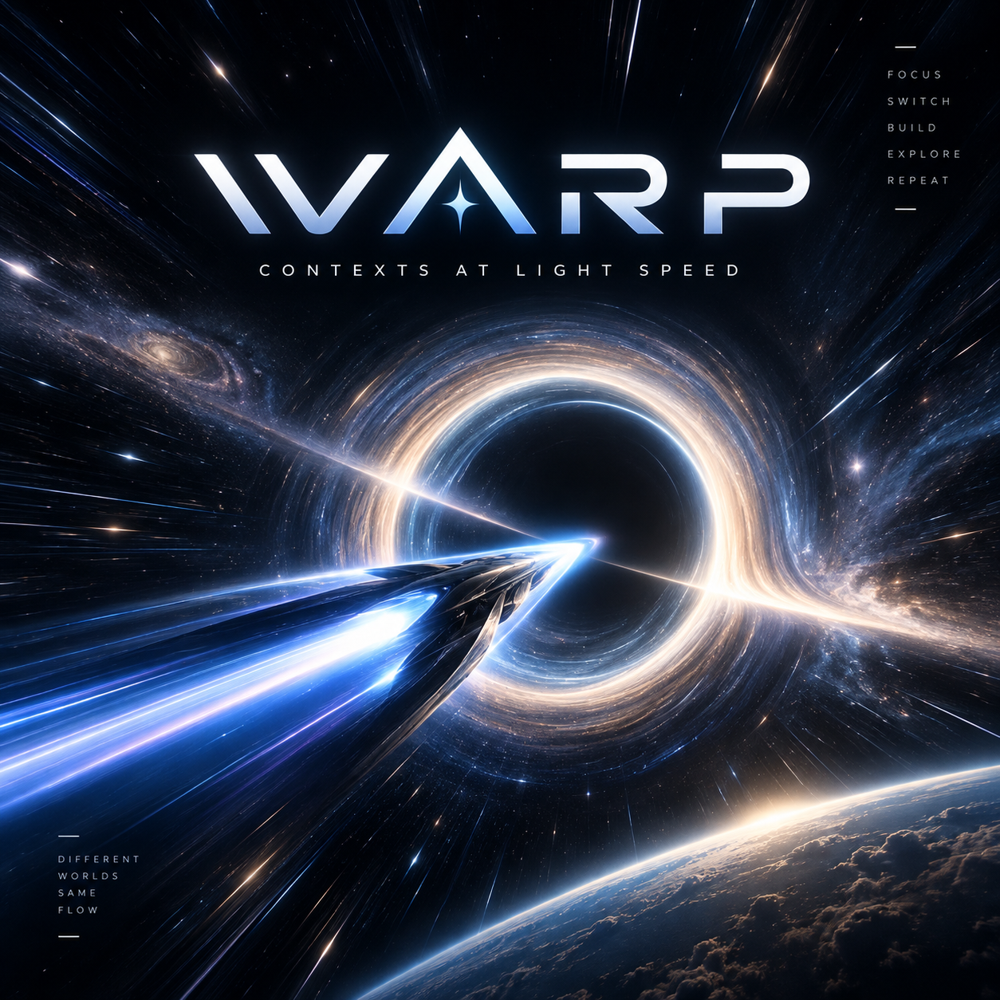

<p align="center">
  
</p>

# WARP

**Switch projects without rebuilding your desktop every time.**

WARP is a macOS workflow/context manager built with **Hammerspoon + Lua**. A workflow can restore the resources that belong to a task across VS Code, Safari, Finder, Terminal, Figma, and Docker Desktop UI.

Instead of treating apps as the unit of state, WARP tracks the **resources inside them**: project windows, tab groups, directories, terminal contexts, and other workflow-specific state.

## Why

Changing projects usually means more than opening another folder.

You may need to recover:

- the right VS Code windows
- the right Safari Tab Group
- the right Finder directory
- the right terminal context
- the right supporting apps
- the presentation state of those resources

WARP turns that reconstruction into one shortcut.

## How it works

```text
shortcut
   ↓
workflow transition
   ↓
capture outgoing context
   ↑
resolve target resources
   ↓
restore adapters
   ├── VS Code
   ├── Safari
   ├── Finder
   ├── Terminal
   ├── Figma
   └── Docker Desktop
   ↑
verify / timeout / isolate failures
```

Each adapter owns its own resource identity and restoration rules. Resources can be shared across workflows, and transitions are serialized so overlapping switches do not corrupt state.

## Engineering ideas

- **resource identity over app identity** — track the thing the workflow cares about, not just whether an app is open
- **capture → transition → restore** lifecycle
- **bounded polling and timeouts** instead of waiting forever on UI state
- **failure isolation** so one adapter does not take down the whole transition
- **safe reopening checks** to avoid duplicating resources
- **serialized transitions and cancellation** for asynchronous switching
- **persistent workflow state** with corruption handling
- **explicit unsupported cases** instead of pretending every macOS state can be restored reliably

## Interaction

Hold **Control + Option + Command** to reveal the workflow wheel, then press the configured number.

`Control + Option + Right/Left` navigates registered Spaces for the active workflow.

## Configuration

```lua
return {
  general = {
    label = "GENERAL",
    key = "0",
  },

  warp = {
    label = "WARP",
    key = "3",
    finder = "/absolute/path/to/WARP",
  },
}
```

Configuration is data-only Lua. Duplicate selectors and unknown fields are rejected.

## Install

Requires macOS, Hammerspoon, Accessibility permission, and Apple command-line tools.

```bash
bash install.sh
bash install.sh --install-loader
```

The installer preserves existing configuration and refuses to modify a symlinked Hammerspoon init file.

## Current status

Safari AX switching has passed live testing. Some newer lifecycle behaviour still needs live acceptance across the full supported adapter set.

For implementation details, edge cases, and current limitations, see [`docs/implementation-report.md`](docs/implementation-report.md).

## Tech

`Lua` · `Hammerspoon` · `macOS Accessibility APIs` · `AppleScript` · `hs.task`

---

WARP is an experiment in treating **workflow context as restorable state** rather than something the user has to manually reconstruct.
